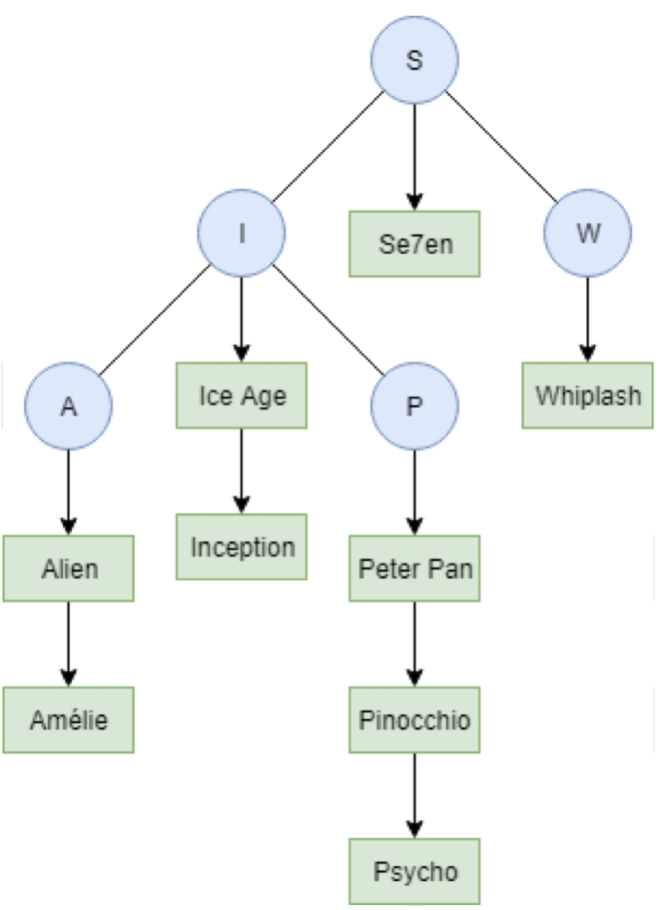
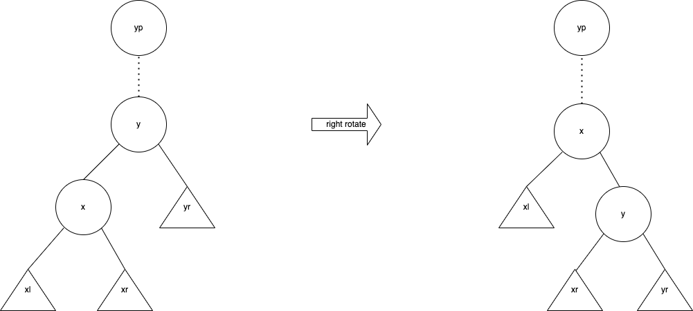

# CSCI 2270 – Data Structures - Assignment 7: Binary Search Trees II

## Objectives

1. Create a super data structure combining BST and LL
2. Right Rotate BST

## Instructions

Please read all the directions *before* writing code, as this write-up contains specific requirements for how the code should be written.

To receive credit for your code, you will need to pass the necessary test cases. Use the following steps to test your code as you work on the assignment:

 1. Open up your Linux terminal, navigate to the build directory of this assignment (e.g. `cd build`).
 2. Run the `cmake ..` command.
 3. Run the `make` command.
 4. If there are no compilation errors, two executables will be generated within the build directory: `run_app_1` and `run_tests`.
 4. If you would like to run your program, execute `run_app_1` from the terminal by typing `./run_app_1 <Required argument>`.
 5. To run the grading tests, execute `run_tests` from the terminal by typing `./run_tests`.

## Overview

Conceptually, this assignment builds off the previous assignment but with a different data structure. *DO NOT MODIFY THE HEADER FILE.* However, you may implement helper functions in your .cpp file.

### *MovieTree* Class Specifications

Your task is to implement a Binary Search Tree (BST) where each node is a Linked List (LL) of movie titles. You are also required to perform a right rotation of a given node while maintaining the BST property. The nodes of the tree are alphabetically ordered (i.e. with ‘d’ as a parent node ‘c’ appears in its left sub-tree and ‘e’ appears in its right sub-tree.) The characters are the first letter of the movie. As more than one movie can have the same starting character, within the node, they are stored as an alphabetically sorted Linked List. For example:




Fill in the file `MovieTree.cpp` according to the following specifications.

**MovieTree::MovieTree()**
+ Constructor: Initialize any member variables of the class to default

**void MovieTree::rdelete(TreeNode\* node)**
+ Helper function for destructor to recursively delete the complete tree.

**MovieTree::~MovieTree()**
+ Destructor: Free all memory that was allocated. This includes deallocating the memory of the underlying nodes’ Linked Lists as well.

**void MovieTree::printMovieInventoryHelper(TreeNode\* node)**
+ Helper function for `showMovieCollection` to recursively print the tree.

**void MovieTree::showMovieCollection()**
+ Print every movie in the data structure in alphabetical order of titles. If a `TreeNode` contains an empty linked list, do not print anything for that node (BST or LL). Please use the following format, for `TreeNode t` and `LLMovieNode m`:

```
// for every non-empty TreeNode (t) in the tree 

cout << "Movies starting with letter: " << t->titleChar << endl;

// for every LLMovieNode (m) attached to t
cout << " >> " << m->title << " " << m->rating << endl;
```

Sample output format:

```
Movies starting with letter: B
 >> Bowling for Columbine 8
Movies starting with letter: D
 >> Dancin' Outlaw 8.1
 >> Dogtown and Z-Boys 7.7
 >> Down from the Mountain 7.4
```

**TreeNode\* MovieTree:: addHelper(TreeNode\* root, TreeNode\* parentpointer, int \_ranking, string \_title, int \_year, float \_rating)**
+ Helper function for `insertMovie` recursively add nodes to the BST. 


**void MovieTree::insertMovie(int ranking, string title, int year, float rating)**
+ Add a movie to the data structure in the correct place based on its `title`.
    + Create a Linked List node with the associated data (`ranking, title, year, and rating`)
    + If no tree node exists (based on the first character of the title), create a new tree node and insert the newly created Linked List node into it. 
    + Otherwise, insert into an existing Linked List and ensure alphabetical order is maintained. `node->title < node->next->title`
    *Hint: you can compare strings with `<, >, ==, etc.` Also, you may assume that no two movies have the same title.*

+ When adding a new `TreeNode`, ensure its parent pointers are set.

**void MovieTree:: removeMovieRecord(std::string title)**
+ Delete the Linked List node that contains the `title`.
    + If deletion results in an empty Linked List, leave the associated tree node with a NULL pointer to indicate the list is empty.
    + If the movie does not exist in the data-structure, print the following message 
    `cout << "Movie not found."<< endl;`


**void MovieTree:: removeLLnodes(TreeNode\* node)**
+ Removes LL nodes of a given node in BST.


**TreeNode\* MovieTree:: getSuccessor(TreeNode\* node)**
+ Returns the leftmost node in the given subtree, where *node* is the root of the subtree.


**TreeNode\* MovieTree:: removeBSTNodeHelper(TreeNode\* node, TreeNode\* parent, char titleFirstLetter)**
+ Helper for `removeBSTNode` to recursively delete a node in BST.


**void MovieTree:: removeBSTNode(char titleFirstLetter)**
+ Delete the BST node which contains Linked list of movies starting with `titleFirstLetter`.
    + Consider conditions where the node to delete can be :
        + A leaf node.
        + Node having only left child. 
        + Node having only right child.
        + Node having both right child and left child.
    + Make sure to delete all Linked List nodes attached to a BST node.
    + If the parent of a particular node changes due to deletion, make sure to do necessary changes to its parent pointer.
    + If all LinkedList nodes of a node are deleted, point the head to nullptr.
    + Deleting a particular node twice will result in "[ERROR] Attempted to delete a node that was never allocated." Such edge cases must be handled.

**void MovieTree::rightRotation(TreeNode\* curr)**

Rotate the node `curr` towards the right. Refer to the following illustration. A right rotation is performed at node `y`.

+ Set the parent pointers accordingly:
    + Parent of `x` becomes the parent of `y`
    + Parent of `y` becomes `x`
+ Set the subtree (left and right children) pointers accordingly.
    + The right subtree of `x` becomes the left subtree of `y`. 
    + `y` and its descendants become the right subtree of `x`. 
+ If `y` was the left (or right ) subtree of `yp`, make `x` the left (or right) subtree of `yp` respectively. This can be checked by comparing the title characters of the parent and the child’s node. 
+ Ensure boundary conditions are accounted for: 
    + `y` is root.
    + `y` has no left child.



**The following functions are available as a part of the starter code.**

**void MovieTree::preorderTraversal()**
+ This function performs a preorder traversal in the tree, printing the title character at each node. This will print the title characters in a preorder fashion. This will be useful for debugging purposes. If you want, you may use this function to create your `inorderTraversal()` and `postorderTraversal()` functions.

**TreeNode\* MovieTree::searchCharNode(char key)**
+ This function returns a node in the tree with the `titleChar` key.


### Order of function implementation

1. rdelete ,Destructor and Constructor
2. addHelper, insertMovie, printMovieInventoryHelper, showMovieCollection
3. removeMovieRecord
4. removeLLnodes, getSuccessor, removeBSTNodeHelper, removeBSTNode
4. rightRotation

### Main driver file [Main driver is provided in starter code]

***NOTE: Main driver file is provided in starter code. You do not have to code it. We will walk through a brief introduction of the driver here***

Your main function should first read information about each movie from a file and store that information in a `MovieTree` object. The name of the file is passed as a *command-line argument*. It is in the format:

```
<Movie 1 ranking>,<Movie 1 title>,<Movie 1 year>,<Movie 1 rating>
<Movie 2 ranking>,<Movie 2 title>,<Movie 2 year>,<Movie 2 rating>
Etc...
```

**Note: Insert the nodes to the tree in the order they are read in.** 

After reading in the information on each movie from the file, display a menu to the user.

```
cout << "======Main Menu======" << endl;
cout << "1. Delete a movie" << endl;
cout << "2. Show the inventory" << endl;
cout << "3. Right rotate the tree" << endl;
cout << "4. Quit" << endl;
```

The options should have the following behavior:

**1. Delete a movie**
+ Call your `removeMovieRecord` function on a title specified by the user. Prompt the user for a movie title using the following code:
`cout << "Enter a movie title:" << endl;`

**2. Show the inventory**
+ Call your tree’s `showMovieCollection` function

**3. Right rotate the tree**
+ Ask the user to enter the `titleChar` for the node to rotate right. If that is a valid node perform the rotation.

```
cout << ""give the titleChar of the node:"" << endl;
string nodename;
getline(cin, nodename);
TreeNode* rNode = movies.searchCharNode(nodename[0]);
if (rNode)
    movies.rightRotation(rNode);
```

**4. Quit**
+ Exit after printing a friendly message to the user:
`cout << "Goodbye!" << endl;`

